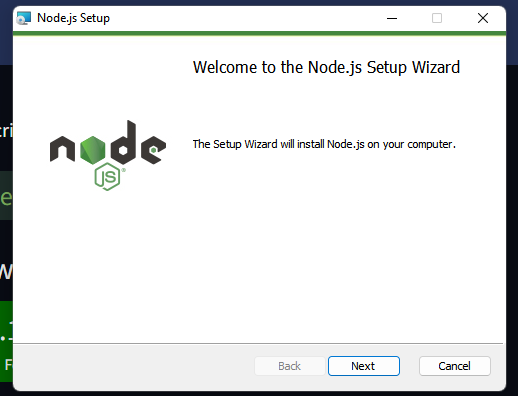
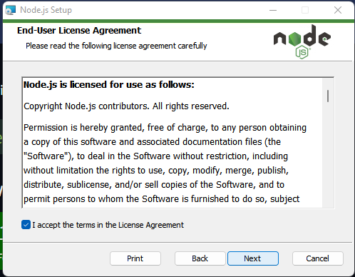
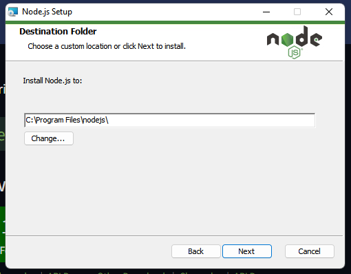
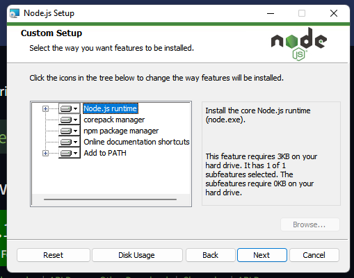
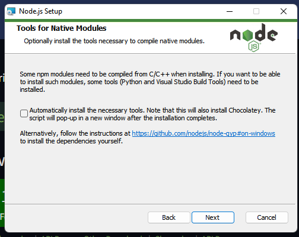
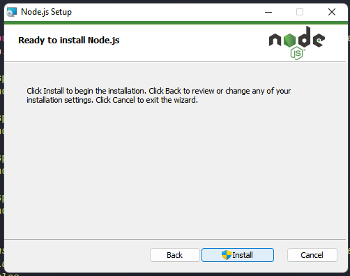
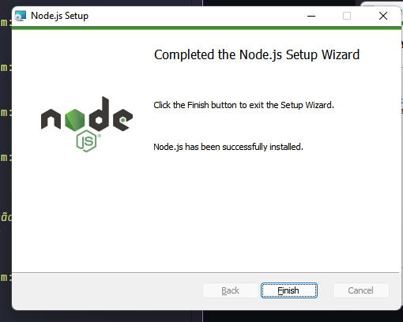
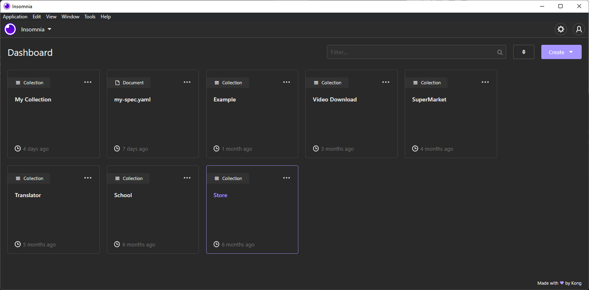

# Instalação das ferramentas necessárias

## Ferramentas

 - Insominia
 - NodeJS
 - Scoop
 - PlanetScale CLI

## Ferramentas opcionais
 - VS Code
 - Yarn 

### Instalação do NodeJS

Entre no site oficial do [NodeJS](https://nodejs.org/en/) e baixe a versão LTS para poder evitar problemas na execução. Depois do instalador baixado executeo e aperte next.

<div style="width: 100%; display: flex; justify-content: center; margin-bottom: 20px;">
    
</div>
<div style="width: 100%; display: flex; justify-content: center; margin-bottom: 20px;">
    
</div>
<div style="width: 100%; display: flex; justify-content: center; margin-bottom: 20px;">
    
</div>
<div style="width: 100%; display: flex; justify-content: center; margin-bottom: 20px;">
    
</div>

> Não marque a opção para instalar ferramentas extras. Pois para que essa opção funcione
> precisa estar com o chocolatey e esses pacotes não são necessários para que 
> execute projetos mais simples.

<div style="width: 100%; display: flex; justify-content: center; margin-bottom: 20px;">
    
</div>

Depois disso só colocar para instalar, o instalados vai pedir permissão do adiministrador, mas é só aceitar. A instalação demora de 3 à 5 minutos dependendo do computador. 

<div style="width: 100%; display: flex; flex-direction: column; justify-content: center; align-items: center; margin-bottom: 20px;">
    
    
</div>

### Instalação do insominia

A instalação do Insominia é mais simple, basta acessar o site oficial do [Insominia](https://insomnia.rest/download) e baixar seu instalador. Depois do download basta executá-lo que o próprio instalador faz as configurações necessárias e quando terminar já irá abrir. 



> Também pode ser usado outra ferramenta de teste se preferir, porém neste tutorial 
> só terá a instalação do Insominia, uma outra ferramenta usada para fazer requests
> em ambiente de desenvolvimento ou produção em api's é o [Postman](https://www.postman.com/downloads/)


### Instalação do Scoop

Para instalar o Scoop já é mais complicado, abra o power-shell como adiministrador e execute esse comando.

```shell
> $ irm get.scoop.sh | iex
```

Se houver erro de permissão ao executar o comando execute esse outro comando e em seguida tente executar novamente.

```shell
> $ Set-ExecutionPolicy RemoteSigned -Scope CurrentUser
```

### Instalação do PlanetScale CLI

O PlanetScale CLI é utilizado para fazer uma proxy entre o seu localhost e o banco de dados em seus servidores espalhados pelo mundo. Para instalá-lo, com o terminal como adiministrador execute os comandos.

```shell
> $ scoop bucket add pscale https://github.com/planetscale/scoop-bucket.git
> $ scoop install pscale mysql
```

Para atualizar a CLI se já estiver instalado basta rodar o comando.

```shell
> $ scoop update pscale
```

## Instalação das ferramentas adicionais

### Instalação do Visual Studio Code

Basta baixar o instalador no site da Microsoft [clicando aqui...](https://code.visualstudio.com/) e depois de seu download realizar a instalação padrão do programa.

### Instalação do yarn

O Yarn é um package manager construído para gerenciar pacotes do NodeJS, para instalar ele você é obrigado a já ter instalado o NodeJS, para que você tenha acesso ao gerenciador padrão do Node que é o npm e sua ferramenta que é usada para criar executar algumas CLI, por exemplo, usado para criar projetos em ReactJS, NextJS e VueJS. Também há outras formas de instalação, porém a mais segura e garantida de sucesso é pelo genrenciador padrão do Node. Para instalar ele você precisará abrir o terminal, power shell, cmd ou o Windows Terminal e rodar o comando: 

> Instalação com NPM

```shell
> $ npm install --global yarn
```

> Instalação com Scoop

```shell
> $ scoop install yarn
> $ scoop install nodejs
```

> Instalação com Chocolatey

```shell
> $ choco install yarn
```

> Instalação por MSI

Link do **.msi**: https://classic.yarnpkg.com/latest.msi

Para verificar se o yarn foi instalado com sucesso basta rodar: 
```shell
> $ yarn --version
```
